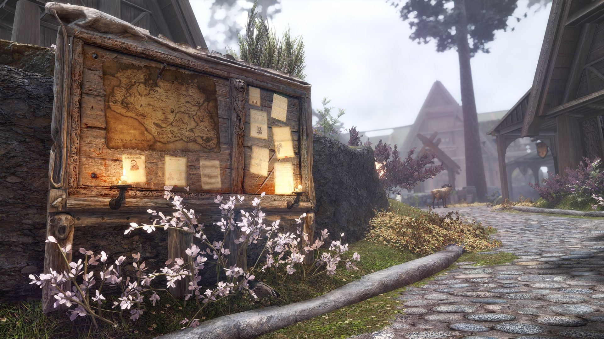

# QuestBoard ⚔️

**QuestBoard** is an immersive, fantasy-themed collaborative task manager inspired by *The Elder Scrolls* and *The Witcher*. It transforms mundane project management into an epic adventure, allowing teams to post "quests" (tasks) on a shared, infinite wooden board.



## ✨ Features

- **Infinite Canvas**: Pan and zoom across a massive 3200x1800 board to organize your quests.
- **Real-Time Collaboration**: Changes are synced instantly across all connected users. See quests appear as your party members add them!
- **Immersive UI**:
    - **Wooden Board**: A rich, textured background for your quests.
    - **Parchment Notes**: Tasks look like handwritten notes on parchment.
    - **Scroll View**: Click any quest to unfurl it into a detailed scroll view.
- **Quest Management**:
    - **Drag & Drop**: Freely arrange quests anywhere on the board.
    - **Tags & Assignees**: Color-coded tags (Magic, Smithing, Lore) and assignee tracking.
    - **Image Attachments**: Pin sketches or maps directly to your quests.
- **Lock Mode 🔒**: Prevent accidental movement or deletion by locking the board while keeping quests clickable.
- **Persistence**: All data is safely stored in a SQLite database (`data.db`).

## 🛠️ Tech Stack

- **Backend**: Python (FastAPI)
- **Database**: SQLite
- **Frontend**: Vanilla JavaScript, HTML5, CSS3
- **Styling**: Custom CSS with Google Fonts (*Cinzel* & *Crimson Text*)

## 🚀 Getting Started

### Prerequisites

- Python 3.8+
- `uv` (recommended) or `pip`

### Installation

1.  **Clone the repository**:
    ```bash
    git clone https://github.com/bugswriter/questboard.git
    cd questboard
    ```

2.  **Install dependencies**:
    ```bash
    uv sync
    # OR
    pip install fastapi uvicorn jinja2 python-multipart
    ```

3.  **Run the server**:
    ```bash
    uv run uvicorn main:app --reload
    # OR
    uvicorn main:app --reload
    ```

4.  **Open your browser**:
    Navigate to `http://localhost:8000` to start your adventure!

## 🎮 Controls

- **Pan**: Click and drag on the background (or hold Space).
- **Zoom**: Mouse wheel or use the `+` / `-` buttons.
- **Add Quest**: Click the big red `+` button.
- **Lock Board**: Click the 🔓 icon in the top bar.
- **View Details**: Click on any note to open the Scroll View.
- **Abandon Quest**: Click the skull icon ☠ on a note (requires unlocked board).

## 🛡️ License

This project is free to use for all adventurers. May your road lead you to warm sands.
